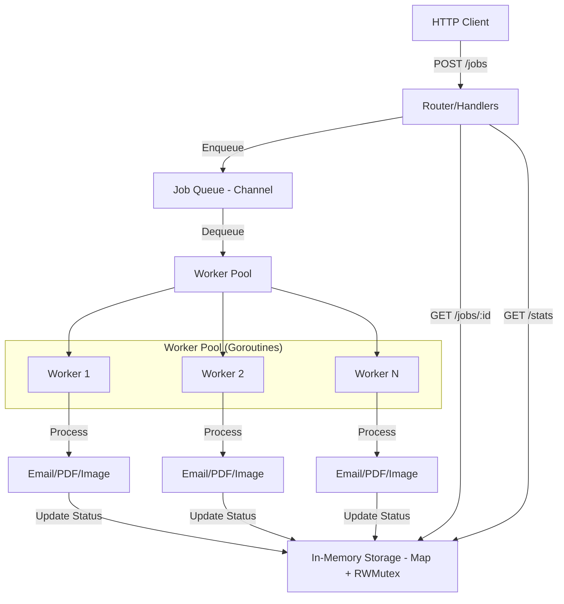

# 🚀 GoQueue: Job Queue and Asynchronous Processing System in Go

<p align="center">
  <b>English</b> | <a href="README.pt-br.md">Português</a>
</p>

<p align="center">
  
  
  
  
</p>

This project implements a **job queue** and **asynchronous processing system** in **Go (Golang)**, showcasing the efficient use of **goroutines**, **channels**, **worker pools**, and **graceful shutdown**. It provides a robust solution for handling time-consuming tasks, such as sending emails, generating PDF reports, or processing images, without blocking the application's main thread.

## ✨ Features

*   **Concurrent Job Queue:** Utilizes `channels` to manage the job queue safely and efficiently.
*   **Advanced Worker Pool:** Manages the worker lifecycle using `golang.org/x/sync/errgroup`.
*   **Asynchronous Processing:** Allows the application to respond quickly while lengthy tasks are executed in the background.
*   **Robust Graceful Shutdown:** Deep integration with `context.Context` ensures that ongoing jobs are completed before shutdown.
*   **RESTful API:** Provides an HTTP interface to enqueue new jobs, query the status of existing jobs, and obtain queue statistics.
*   **Structured Logging:** Integration with `zap` for high-performance and easily analyzable logs.

## 🏗️ Architecture

The `GoQueue` architecture is modular and based on components that communicate asynchronously. The diagram below illustrates the flow of a job from its creation to processing:



### Key Components

*   **`JobQueue` (`internal/queue`):** Manages the job queue using a `channel` for communication between the producer (API) and consumers (workers). It uses a `map` and `sync.RWMutex` to safely store job states in memory for concurrency.
*   **`WorkerPool` (`internal/worker`):** Responsible for creating and managing a pool of `goroutines` (workers) that consume jobs from the `JobQueue`. It uses `errgroup` to ensure the pool is managed as an atomic unit of work.
*   **`Router` (`internal/router`):** Defines the HTTP API routes using Go's standard `net/http` package, forwarding requests to the appropriate `handlers`.
*   **`Handlers` (`internal/handlers`):** Contains the logic for receiving HTTP requests, creating jobs, and interacting with the `JobQueue`.
*   **`Job` (`internal/models`):** A structure representing a job, including its ID, type, payload, status, and timestamps.

## 🚀 How to Run the Project

### Prerequisites

*   [Go](https://golang.org/doc/install) (version 1.18 or higher)
*   [Docker](https://docs.docker.com/get-docker/) (optional, for running via Docker)

### 1. Clone the Repository

```bash
git clone https://github.com/shakarpg/goqueue.git
cd goqueue
```

### 2. Install Dependencies

```bash
go mod tidy
```

### 3. Run the Application

```bash
go run cmd/main.go
```

The server will start on port `8080` (or the port defined by the `PORT` environment variable).

## 🛑 Graceful Shutdown

`GoQueue` implements an advanced *graceful shutdown* mechanism. Upon receiving an interrupt signal (`SIGINT` or `SIGTERM`), the HTTP server stops accepting new requests, and the `errgroup` signals all workers to complete their current tasks. The system waits until all components confirm safe termination before exiting the process.

## 🧠 Demonstrated Concepts

### 🔹 Goroutines & Channels
*   Workers running concurrently with state management via `errgroup`.
*   Efficient communication via channels.
*   Use of `select` statement for cancellation and multiplexing.

### 🔹 Worker Pool Pattern
*   Pool of workers processing jobs in parallel.
*   Automatic load distribution and centralized error monitoring.

### 🔹 Context & Advanced Concurrency
*   Use of `context.Context` for cascading cancellation.
*   Utilization of `golang.org/x/sync/errgroup` for synchronizing groups of goroutines.

## 🤝 Contributions

Contributions are highly welcome! If you have ideas for improvements, bug fixes, or new features, feel free to open a **Pull Request**.

## 📄 License

This project is licensed under the **MIT License**. See the [LICENSE](LICENSE) file for more details.

## 👤 Author

**Rafael Galhardo**  
GitHub: [@shakarpg](https://github.com/shakarpg)
LinkedIn: [linkedin.com/in/rpg2011](https://linkedin.com/in/rpg2011)
