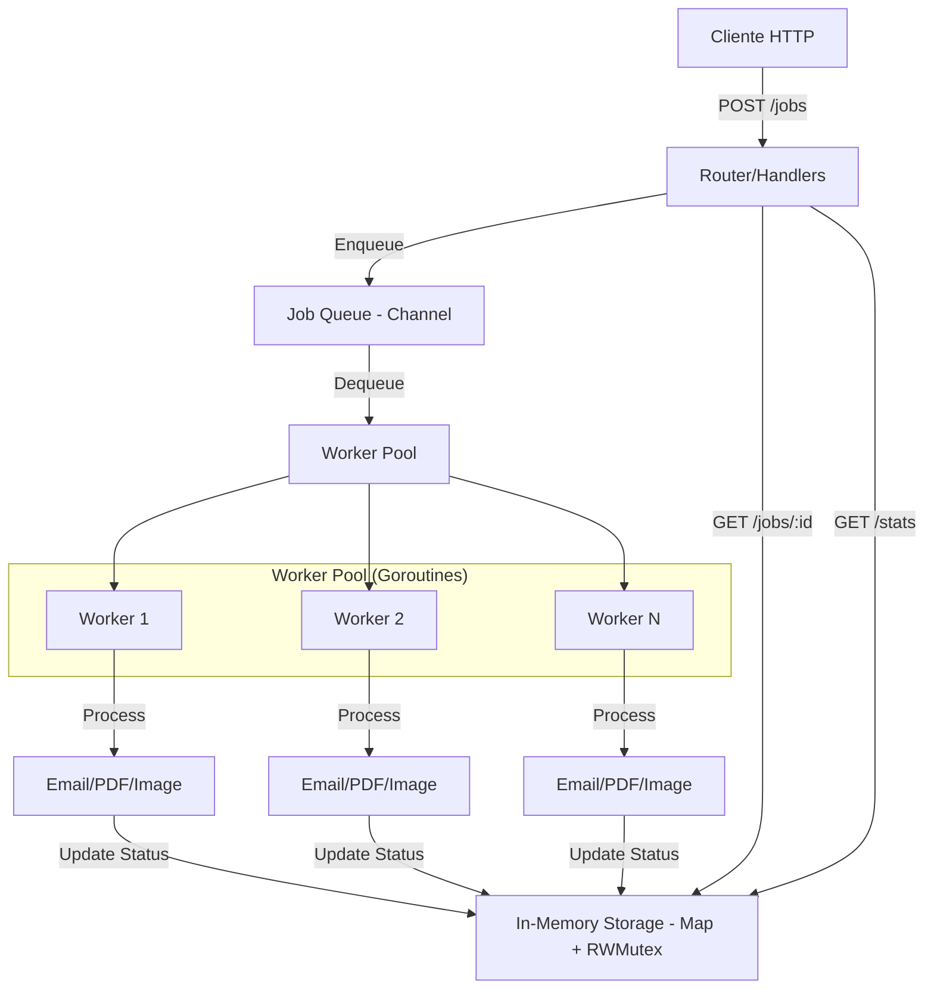

# 🚀 GoQueue: Sistema de Fila de Jobs e Processamento Assíncrono em Go

<p align="center">
  <a href="README.md">English</a> | <b>Português</b>
</p>

<p align="center">
  
  
  
  
</p>

Este projeto implementa um sistema de **fila de jobs** e **processamento assíncrono** em **Go (Golang)**, demonstrando o uso eficiente de **goroutines**, **channels**, **worker pools** e **graceful shutdown**. É uma solução robusta para lidar com tarefas que consomem tempo, como envio de e-mails, geração de relatórios PDF ou processamento de imagens, sem bloquear a thread principal da aplicação.

## ✨ Funcionalidades

*   **Fila de Jobs Concorrente:** Utiliza `channels` para gerenciar a fila de jobs de forma segura e eficiente.
*   **Worker Pool Avançado:** Gerenciamento de ciclo de vida dos workers utilizando `golang.org/x/sync/errgroup`.
*   **Processamento Assíncrono:** Permite que a aplicação responda rapidamente enquanto tarefas demoradas são executadas em segundo plano.
*   **Graceful Shutdown Robusto:** Integração profunda com `context.Context` para garantir que os jobs em andamento sejam concluídos antes do desligamento.
*   **API RESTful:** Interface HTTP para enfileirar novos jobs, consultar o status de jobs existentes e obter estatísticas da fila.
*   **Logging Estruturado:** Integração com `zap` para logs de alta performance e fácil análise.

## 🏗️ Arquitetura

A arquitetura do `GoQueue` é modular e baseada em componentes que se comunicam de forma assíncrona. O diagrama abaixo ilustra o fluxo de um job desde a sua criação até o processamento:



### Componentes Principais

*   **`JobQueue` (`internal/queue`):** Gerencia a fila de jobs usando um `channel` para comunicação entre o produtor (API) e os consumidores (workers). Utiliza um `map` e `sync.RWMutex` para armazenar o estado dos jobs em memória de forma segura para concorrência.
*   **`WorkerPool` (`internal/worker`):** Responsável por criar e gerenciar um pool de `goroutines` (workers) que consomem jobs da `JobQueue`. Utiliza `errgroup` para garantir que o pool seja gerenciado como uma unidade atômica de trabalho.
*   **`Router` (`internal/router`):** Define as rotas da API HTTP usando o pacote `net/http` padrão do Go, encaminhando as requisições para os `handlers` apropriados.
*   **`Handlers` (`internal/handlers`):** Contém a lógica para receber requisições HTTP, criar jobs e interagir com a `JobQueue`.
*   **`Job` (`internal/models`):** Estrutura que representa um job, incluindo seu ID, tipo, payload, status e timestamps.

## 🚀 Como Rodar o Projeto

### Pré-requisitos

*   [Go](https://golang.org/doc/install) (versão 1.18 ou superior)
*   [Docker](https://docs.docker.com/get-docker/) (opcional, para rodar via Docker)

### 1. Clonar o Repositório

```bash
git clone https://github.com/shakarpg/goqueue.git
cd goqueue
```

### 2. Instalar as dependências

```bash
go mod tidy
```

### 3. Rodar a aplicação

```bash
go run cmd/main.go
```

O servidor será iniciado na porta `8080` (ou na porta definida pela variável de ambiente `PORT`).

## 🛑 Graceful Shutdown

O `GoQueue` implementa um mecanismo de *graceful shutdown* avançado. Ao receber um sinal de interrupção (`SIGINT` ou `SIGTERM`), o servidor HTTP para de aceitar novas requisições e o `errgroup` sinaliza todos os workers para finalizarem suas tarefas atuais. O sistema aguarda até que todos os componentes confirmem o encerramento seguro antes de finalizar o processo.

## 🧠 Conceitos Demonstrados

### 🔹 Goroutines & Channels
*   Workers rodando concorrentemente com gerenciamento de estado via `errgroup`.
*   Comunicação eficiente via channels.
*   Uso de `select` statement para cancelamento e multiplexação.

### 🔹 Worker Pool Pattern
*   Pool de workers processando jobs em paralelo.
*   Distribuição automática de carga e monitoramento de erros centralizado.

### 🔹 Context & Advanced Concurrency
*   Uso de `context.Context` para cancelamento em cascata.
*   Utilização de `golang.org/x/sync/errgroup` para sincronização de grupos de goroutines.

## 🤝 Contribuições

Contribuições são muito bem-vindas! Se você tiver ideias para melhorias, correções de bugs ou novas funcionalidades, sinta-se à vontade para abrir um **Pull Request**.

## 📄 Licença

Este projeto está licenciado sob a **MIT License**. Veja o arquivo [LICENSE](LICENSE) para mais detalhes.

## 👤 Autor

**Rafael Galhardo**  
GitHub: [@shakarpg](https://github.com/shakarpg)
LinkedIn: [linkedin.com/in/rpg2011](https://linkedin.com/in/rpg2011)
